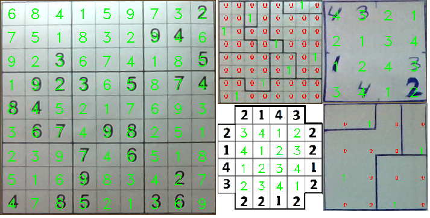
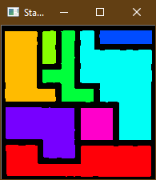
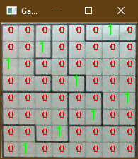

# LogicGamesSolver
 Python tool to solve logic games with AI, Deep Learning and Computer Vision

----------------



------

## Table of contents

* [Basic Overview](#basic-overview)
* [Project structure](#project-structure)
* [System Requirements](#system-requirements)
* [Setup](#setup)
* [How it works](#how-it-works)
* [References](#references)

## Basic Overview

This project mixes Computer Vision and Artificial Intelligence to solve logic puzzle games like *Sudoku*, *Stars Battle* and *Skyscrapers*.

The execution consists of 2 phases:

| 1. Board Detection                                           | 2. Game solving                                              |
| ------------------------------------------------------------ | ------------------------------------------------------------ |
|  |  |
| The software detects the board showed by the user (in real-time or analyzing a local image). Then analyzes the structure to understand the needed informations to solve the game. | The informations collected are then used to solve the puzzle considering it as a Constraints Satisfaction Problem using a Backtracking algorithm to find the solution, given the game rules. |

**Language**: *Python*

**Frameworks**: *OpenCV*, *Tensorflow*

**Algorithms**: Constraints Satisfaction Problem Backtracking, Digits Classifier (CNN), Image Contours Finding and Warping 

## Project structure

```
TODO	
```

## System Requirements

- **Python 3.8**

- **Numpy 1.19.2**

- **OpenCV 4.0.1** 

  
